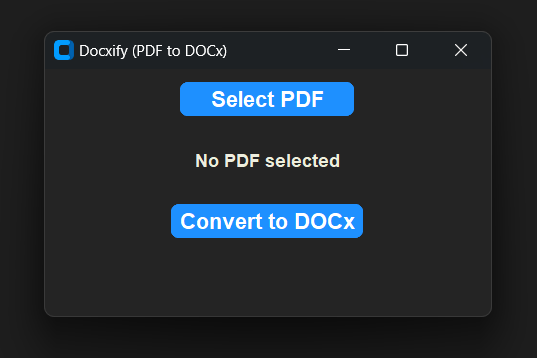

# Docxify (PDF to DOCx Converter)

**Docxify** is a user-friendly desktop application that allows you to easily convert PDF files to DOCx format with just a few clicks. The application is designed with a simple interface that makes the conversion process fast and intuitive.




## Usage

1. After running the script, the application window will appear.
2. Click on **Select PDF** to choose a PDF file from your local machine.
3. Once the file is selected, click **Convert to DOCx** to begin the conversion.
4. The converted DOCx file will be saved in the output folder specified in your configuration.

## Installation

To run this application locally, follow these steps:

1. Clone this repository to your local machine:

    ```bash
    git clone https://github.com/your-username/Docxify
    ```

2. Install the necessary Python libraries:

    ```bash
    pip install -r requirements.txt
    ```

    *Make sure you have Python installed. You can download it from [here](https://www.python.org/downloads/).*

3. Run the application by executing the `docxify.py` script:

    ```bash
    python docxify.py
    ```

## Requirements

- Python 3.x
- Libraries:
  - `tkinter` (for GUI)
  - `pdf2docx` (for PDF to DOCx conversion)


## Contributing

If you'd like to contribute, please fork the repository and make changes as you'd like. Pull requests are warmly welcome.


